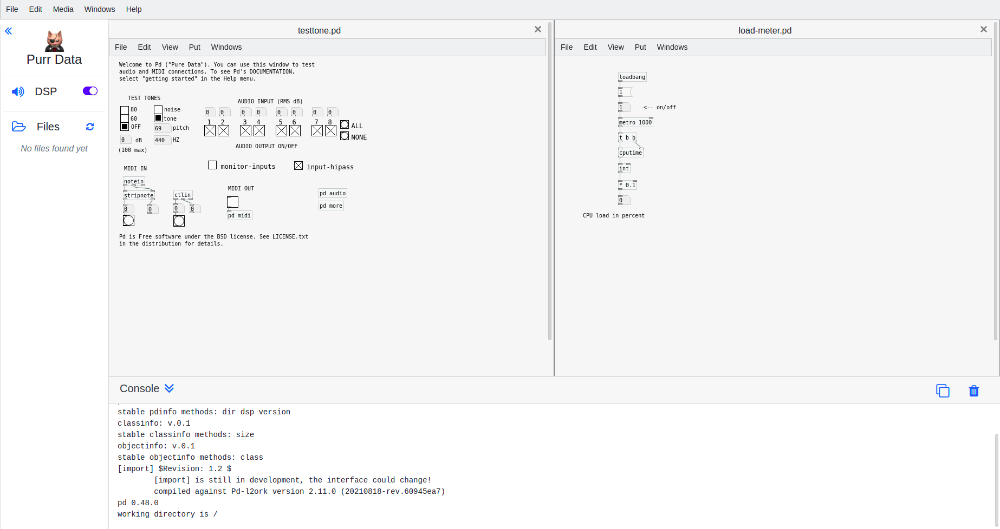

# Purr Data


## Table of Contents
- [Overview](#overview)
- [Work Done](#work-done)
- [GSoC Contributions](#gsoc-contributions)
- [Setup](#setup)
- [Directory Structure](#directory-structure)
- [Future Work](#future-work)
- [Reporting Bugs](#reporting-bugs)

## Overview
This document describes the work that was done under [Google Summer of Code 2021](https://summerofcode.withgoogle.com/) a.k.a. GSoC for organization Purr Data. The goal of this project was to make the Purr Data web app more usable, stable and reliable.

**Purr Data** a.k.a. **Pd-l2ork 2** is an improved version of Miller Puckette’s Pd.

[Pd](https://puredata.info/) (Pure Data) is a graphical data-flow programming environment which is geared towards real-time interactive computer music and multimedia applications. It is a full-featured open-source alternative to its commercial sibling, Cycling74’s [Max](https://cycling74.com/products/max-features).

[Purr Data](https://agraef.github.io/purr-data/) serves the same purpose, but offers a new and much improved graphical user interface and includes many 3rd party plug-ins. Like Pd, it runs on Linux, macOS and Windows, and is open-source throughout.

You can try the latest version from https://purrdata.glitch.me/

## Work Done
### - Making shortcuts work depending on the device platform (macOS, Windows, Linux)
Made the shortcuts on the web app work the same way as on the desktop app depending upon
the device platform. Some shortcuts were reserved by the browser so alternate shortcut keys
were assigned to them in web app.

Fixed shortcuts when creating objects
### - Improving the file manager so files/folders can be added/renamed/deleted
Added the renaming and deleting of files feature, so that user can conveniently do these
operations directly from the files list in the sidebar.
### - Improving the layout of menu and patch windows for better user experience
Made the canvases rearrangeable by dragging its top bar, added close button in canvas itself,
improved scrollbar appearance, replaced the view options from global menu bar with shortcut
keys. Added spinning refresh icon to file list and improved console, sidebar animation, added
separate scrolling of each canvas.

Sidebar shows when appropriate action is performed. Added shadows and round borders to
menus. Fixed menu hiding behind other elements and not closing on mouse click. Added copy
feature in console, implemented tooltip feature.

Added traversing feature to console search matches and improved marks by changing the
highlight all mark colors, padding. Added open only supported file type feature.
### - Fixing many small bugs to make the app more stable and usable
Redesigned Preferences, Properties, Array options, etc. to show in separate dialogs instead of
sidebar. Also added dialog for sending messages to Pd/Canvas. Removed Web MIDI error alert
on startup in unsupported browsers.

Fixed loading modal getting stuck on startup sometimes. Fixed wrong mouse coordinates
issues that happened in some situations. Improved initial loading of web app. Added collapsible
and scrollable sidebar, changed “null” to blank in shortcuts. Fixed app stalling on clicking “About
Pd-L2ork” menu option.

## GSoC Contributions
Here is a list of important PRs and commits made for GSoC:

View all my merge requests [here](https://git.purrdata.net/jwilkes/purr-data/-/merge_requests?scope=all&state=all&author_username=prakhar)

- ([#807](https://git.purrdata.net/jwilkes/purr-data/-/merge_requests/807)) Fixed padding of marks in console find
- ([#806](https://git.purrdata.net/jwilkes/purr-data/-/merge_requests/806)) Fixed loading modal getting stuck
- ([#805](https://git.purrdata.net/jwilkes/purr-data/-/merge_requests/805)) Removed Web MIDI error alert on startup
- ([#804](https://git.purrdata.net/jwilkes/purr-data/-/merge_requests/804)) Fixed console head layout
- ([#803](https://git.purrdata.net/jwilkes/purr-data/-/merge_requests/803)) Changed shortcut keys fir Edit mode and Cut
- ([#802](https://git.purrdata.net/jwilkes/purr-data/-/merge_requests/802)) Removed full screen option
-	([#793](https://git.purrdata.net/jwilkes/purr-data/-/merge_requests/793)) Improved preferences layout
-	([#800](https://git.purrdata.net/jwilkes/purr-data/-/merge_requests/800)) Fix shortcut when creating objects
-	([#790](https://git.purrdata.net/jwilkes/purr-data/-/merge_requests/790)) Improved properties layout
-	([#784](https://git.purrdata.net/jwilkes/purr-data/-/merge_requests/784)) Improved scrollbar appearance
-	([#789](https://git.purrdata.net/jwilkes/purr-data/-/merge_requests/789)) Added dialog for sending messages
-	([#788](https://git.purrdata.net/jwilkes/purr-data/-/merge_requests/788)) Added rearrangeable canvas
-	([#787](https://git.purrdata.net/jwilkes/purr-data/-/merge_requests/787)) Added close button in canvas
-	([#785](https://git.purrdata.net/jwilkes/purr-data/-/merge_requests/785)) Shortcuts work depending on the device platform
-	([#783](https://git.purrdata.net/jwilkes/purr-data/-/merge_requests/783)) Remove view menu option from global menu
-	([#779](https://git.purrdata.net/jwilkes/purr-data/-/merge_requests/779)) Added open only supported file type features
-	([#773](https://git.purrdata.net/jwilkes/purr-data/-/merge_requests/773)) Implemented tooltip feature
-	([#770](https://git.purrdata.net/jwilkes/purr-data/-/merge_requests/770)) Added copy feature in console
-	([#767](https://git.purrdata.net/jwilkes/purr-data/-/merge_requests/767)) Added traversing feature to console find
-	([#765](https://git.purrdata.net/jwilkes/purr-data/-/merge_requests/765)) Fixed app stalling on clicking “About Pd-L2ork”
-	([#786](https://git.purrdata.net/jwilkes/purr-data/-/merge_requests/786)) Added rename and delete files feature
-	([#741](https://git.purrdata.net/jwilkes/purr-data/-/merge_requests/741)) Added full screen feature
-	([#758](https://git.purrdata.net/jwilkes/purr-data/-/merge_requests/758), [#759](https://git.purrdata.net/jwilkes/purr-data/-/merge_requests/759), [#760](https://git.purrdata.net/jwilkes/purr-data/-/merge_requests/760)) Added default browser zoom in, zoom out, zoom reset
-	([#713](https://git.purrdata.net/jwilkes/purr-data/-/merge_requests/713)) Fixed all matches showing when “Highlight All” is not selected
-	([#730](https://git.purrdata.net/jwilkes/purr-data/-/merge_requests/730)) Improved animation of rotate icon
-	([#712](https://git.purrdata.net/jwilkes/purr-data/-/merge_requests/712), [#711](https://git.purrdata.net/jwilkes/purr-data/-/merge_requests/711)) Added round borders and shadows to menus.
-	([#720](https://git.purrdata.net/jwilkes/purr-data/-/merge_requests/720)) Fixed scroll bug in Firefox
-	([#680](https://git.purrdata.net/jwilkes/purr-data/-/merge_requests/680)) Added truncate file name feature
-	([#669](https://git.purrdata.net/jwilkes/purr-data/-/merge_requests/669)) Added separate scrolling of each canvas
-	and many more…😀
 

## Setup

### Installing Dependencies (Linux)
```
sudo apt-get install git automake cmake fakeroot dpkg-dev libgconf-2-4
```

### Installing Node.js (macOS, Linux)
```
curl -o- https://raw.githubusercontent.com/nvm-sh/nvm/v0.37.2/install.sh | bash
```

### Installing/Activating Emscripten (macOS, Linux)
```
git clone https://github.com/emscripten-core/emsdk.git
cd emsdk
git pull
./emsdk install latest
./emsdk activate latest
source ./emsdk_env.sh
cd ..
```

### Building Purr Data for Emscripten (macOS, Linux)
```
git clone https://git.purrdata.net/jwilkes/purr-data.git
cd purr-data
git checkout emscripten
make emscripten
```
### Running Purr Data in a web browser
- After the building is successfully completed, visit http://localhost:5000 in your browser.
- You can run `npm start` under `purr-data/emscripten/project/purr-data` to run the app again.

## Directory Structure
- components: Elements that are dynamically added to the page. (canvas, dialogs, menu)
- components/dialogs: Copied dialogs files from `purr-data/pd/nw` folder.
- css: Copied css files from `purr-data/pd/nw/css` folder.
- css/webapp: Styles created for the web browser.
- dist: Browserified Javascript files. (pdgui.js, pd_shortcuts.js, pd_canvas.js)
- libs: External dependencies.
- utils: Common functions used for this project.

## Future Work
- Fix graphical arrays being opened if the patch font size changes.
- Make the work storable and shareable among users.
- Merge global menu bar with canvas menu bar.
- Fix help browser not working in web app.
- Clean the frontend codebase and organize the file system.
- Make the patch window resizable.
- Display the web app inline in an HTML document.
- Improve usability and interface of the web app more so to make it more intuitive.
- Add a testing protocol for front end.
- Continue working on issues and solving bugs to make Purr Data stable and easier to use.

## Reporting Bugs
If you find any bugs, please let us know. You can contact using the [mailing list](http://disis.music.vt.edu/listinfo/l2ork-dev) or create an [issue](https://git.purrdata.net/jwilkes/purr-data/-/issues).
